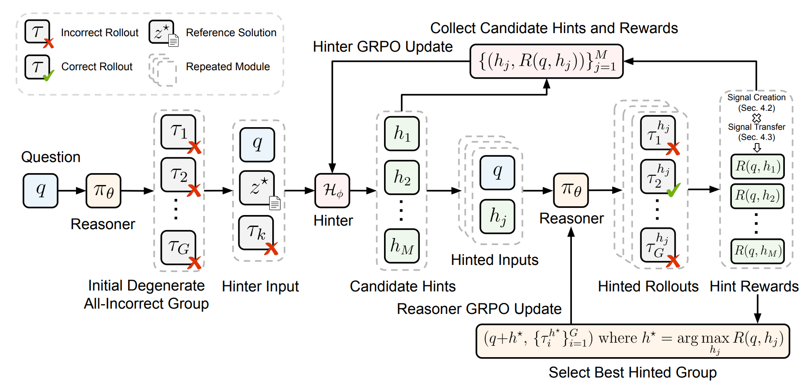

<div align="center">

## Learning to Hint for Reinforcement Learning

Jointly train a hinter policy and a reasoner policy during RL. For each hard question that yields an all-incorrect GRPO group, the hinter generates hints online conditioned on the current reasoner's failure, recovering gradient signal while optimizing for transferability to the no-hint setting.

<p align="center">
  <a href="https://arxiv.org/abs/2604.00698"></a>
  <a href="https://github.com/Andree-9/HiLL"></a>
</p>

</div>




## 🌟 Overview

GRPO suffers from **advantage collapse**: when all sampled rollouts for a question are incorrect, the group yields zero relative advantages and no gradient signal. HiLL addresses this by co-training a hinter policy alongside the reasoner with two key ideas:

**1. Failure-conditioned hint generation.** The hinter generates hints online, conditioned on the question, the current reasoner's failed rollout, and a reference solution. This allows hints to adapt to the reasoner's evolving weaknesses over training, unlike fixed or offline hints.

**2. Hint reliance and transfer-weighted reward.** Not all hints that recover GRPO signal are equally useful. A hint that performs key reasoning steps directly induces high *hint reliance* — correct hinted trajectories become unlikely once the hint is removed, limiting transfer to the no-hint policy. HiLL introduces a transfer-weighted reward that penalizes high-reliance hints, steering the hinter toward concise, conceptual guidance that transfers back to no-hint inference.

## 📦 Setup

1. Create a new virtual environment
    ```bash
    python -m venv ~/.python/hill
    source ~/.python/hill/bin/activate
    ```

2. Install dependencies and wandb login
    ```bash
    git clone https://github.com/Andree-9/HiLL.git
    cd ./HiLL

    bash hill_setup.sh
    ```

3. Get training data prepared by [SAGE](https://github.com/BaohaoLiao/SAGE)

    ```bash
    bash scripts/get_data.sh
    ```

## ⚡ Training

```bash
bash scripts/run_hill.sh
```


## 🎓 Evaluation

```bash
bash scripts/eval.sh
```


## 📝 Citation

If you find HiLL useful, please cite as:

```bibtex
@misc{xia2026hill,
      title={Learning to Hint for Reinforcement Learning},
      author={Yu Xia and Canwen Xu and Zhewei Yao and Julian McAuley and Yuxiong He},
      year={2026},
      eprint={2604.00698},
      archivePrefix={arXiv},
      primaryClass={cs.LG},
      url={https://arxiv.org/pdf/2604.00698},
}
```


## 🙏 Acknowledgments

Our implementation builds on [SAGE](https://github.com/BaohaoLiao/SAGE), whose training data and evaluation codebase we extend for HiLL. We also thank [verl](https://github.com/verl-project/verl) for the RL training framework, [vllm](https://github.com/vllm-project/vllm) for rollout generation, and [oat](https://github.com/sail-sg/oat) for response grading.
